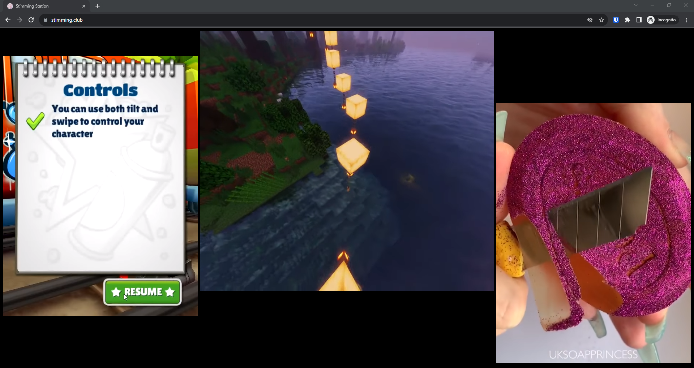

# [stimming.club](https://stimming.club)

## Building

1. Install [Node.js](https://nodejs.org/en/download/prebuilt-installer) (LTS)
2. Open the folder in [Visual Studio Code](https://code.visualstudio.com)
3. Open a Terminal and run `npm install` to install the dependencies and then `npm run dev` to run a dev server at http://localhost:5000
